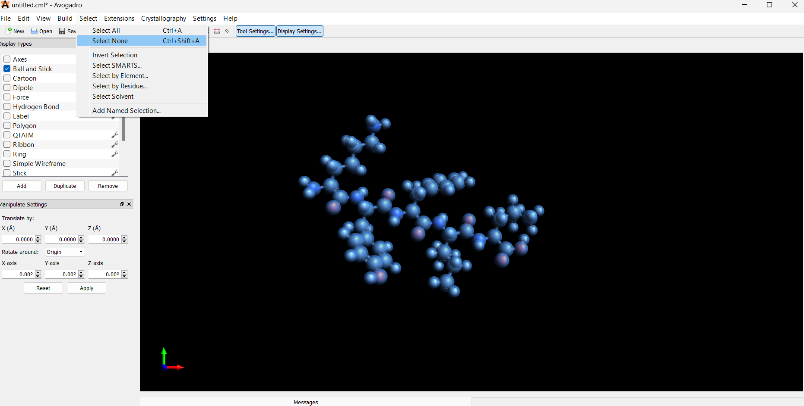

# Avogadro Tutorial

Open Avogadro and on the top, select Build -> Insert -> Peptides.

Click on the different amino acids to build the peptide. In this case we will be creating KYFIL (LYS-TYR-PHE-ILE-LEU).

When creating the D-sterochemistry, you would need to specifically select the alpha carbons on each amino acids and use the INVERT CHIRALITY function in order to individually switch the S configuration of the alpha carbons to R. You will need to select the beta carbon on the side chain of the isoleucine to be swapped. 

Deselect the peptide:

Only select the alpha carbon and beta carbon (on isoleucine)

Once the pdb is saved, if you are building the D sterochemistry, open the pdb in your favorite text editor and add a D to every 3 letter amino acid code. Make sure there are not spaces. 

After the pdb file is constructed, go to [CHARMM.GUI](https://charmm-gui.org/) and go to the PDB reader & manipulator tab.

