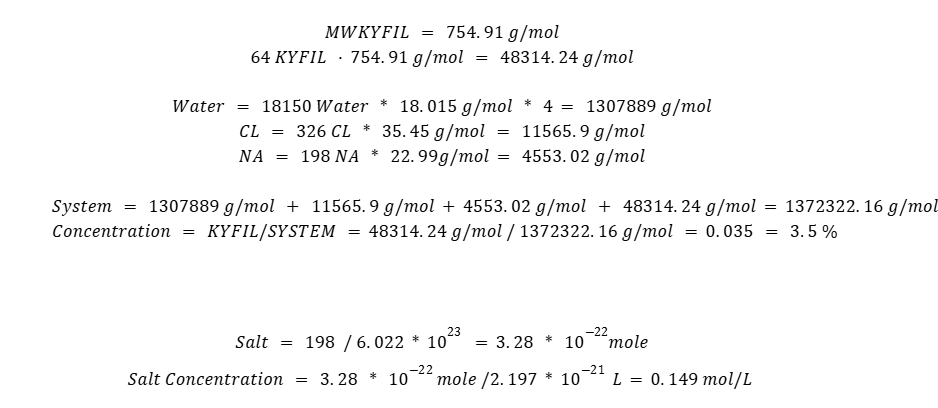

# Coarse Grain with Gromacs Tutorial

The necessary files will be downloadable [here](https://drive.google.com/drive/folders/13CHhxHLBMIX4VO-UOdFUi3loL8YrpLb8?usp=sharing).

Open the terminal in Rivanna and type the following commands:

```gromacs
module load gcc/11.4.0 openmpi/4.1.4 gromacs/2023.2
module spider gromacs/2023.2
Pip install vermouth
export PATH=$PATH:/home/(yourcomputingID)/.local/bin
```

Next, with a Peptide PDB file, use the following command to make it into a coarse grain form.

```gromacs
martinize2 -f KYFIL.pdb  -x KYFIL_CG.pdb -o single_KYFIL.top -ff martini3001 -ss C -cter COOH-ter
```

-ff: pick which force field you would like to use
-ss: secondary structure for the simulation, it is coil since at the beginning there is no structure
-cter: amidate the c terminus, deleting the charge

This command switches the file format from pdb to gro, 
```gromacs
gmx_mpi  editconf -f KYFIL_CG.pdb -o KYFIL_CG.gro -d .5
```

-d: adds a 5 anstrom buffer

Place the peptides into a 4 by 4 by 4 box

```gromacs
gmx_mpi genconf -f KYFIL_CG.gro -nbox 4 4 4 -rot yes -dist 1 2 1 -o KYFIL_64_box_cg.gro
```
-rot: rotate peptide randomly 
-dist: how far each peptides needs to be placed in x y z direction

```gromacs
gmx_mpi solvate -cp KYFIL_64_box_cg.gro -cs water.gro -o Grid_KYFIL_CG_water.gro -box 13 13 13
```
Add water to the box. Each bead of water represents 4 water molecules

    Text generated from solvent:
    Generated solvent containing 18674 atoms in 18674 residues
    Writing generated configuration to Grid_KYFIL_CG_water.gro
    Back Off! I just backed up Grid_KYFIL_CG_water.gro to ./#Grid_KYFIL_CG_water.gro.12#
    Output configuration contains 19698 atoms in 18994 residues
    Volume                 :        2197 (nm^3)
    Density                :     2614.43 (g/l)
    Number of solvent molecules:  18674  


**In your file, you should have a  single_kyfil.top file, which should contain a molecule_0 1. Copy the file and make a new file named system.top**

    Open the system.top file and add the number of solvent molecules (W). Additionally, include the following:
    #include "martini_v3.0.0.itp"
    #include "martini_v3.0.0_solvents_v1.itp"
    #include "martini_v3.0.0_ions_v1.itp"
    #include "molecule_0.itp"

```gromacs
gmx_mpi grompp -f ions.mdp -c Grid_KYFIL_CG_water.gro -p system.top -o ions.tpr
```

Ionize prestep

```gromacs
gmx_mpi genion -s ions.tpr -pname NA -nname CL -neutral -conc 0.15 -o Grid_KYFIL_CG_ion.gro
```
Press 13 for W
    Add salts to the simulation
    -pname: positive charge
    -nname: negative charge
    -neutral: neutralize
    -conc: concentration of salt

**Need to add in system.top file and number of solvent molecules (W, NA, CL)**
Use the following commands on the terminal
grep -c W Grid_KYFIL_CG_ion.gro
grep -c CL Grid_KYFIL_CG_ion.gro
grep -c NA Grid_KYFIL_CG_ion.gro

Using those numbers gathered from the commands, add the values into the system.top file

Your system.top file should look like this.

    #include "martini_v3.0.0.itp"
    #include "martini_v3.0.0_solvents_v1.itp"
    #include "martini_v3.0.0_ions_v1.itp"
    #include "molecule_0.itp"

    [ system ]
    Title of the system

    [ molecules ]
    molecule_0    64
    W 18150
    CL 326
    NA 198



Roughly 3.4 wt% of kyfil

Running the simulation:
Type this into terminal:
```gromacs
gmx_mpi grompp -f minimization.mdp -c Grid_KYFIL_CG_ion.gro -p system.top -o minimization.tpr -maxwarn 2
```

Pre running minimization

Run minimization slurm script (take roughly 2-5 minutes)
**NOTE: RUN THE NEXT COMMAND ON A SLURM SCRIPT**

```gromacs
#!/bin/bash
#SBATCH --nodes=7
#SBATCH --ntasks-per-node=36
#SBATCH --mail-user[computingID]@virginia.edu
#SBATCH --mail-type=END,FAIL,TIME_LIMIT
#SBATCH --time=3-00:00:00
#SBATCH --partition=parallel
#SBATCH -A [allocation]
#SBATCH -o minimize.out

module purge
module load gcc/11.4.0 openmpi/4.1.4 gromacs/2023.2
gmx mdrun -v -deffnm minimization
```

Should look something like this.


Type this into terminal:
```gromacs
gmx_mpi grompp -f dynamic.mdp -c minimization.gro -p system.top -o dynamic.tpr 
```

Pre running dynamic run
**NOTE: RUN THE NEXT COMMAND ON A SLURM SCRIPT**

```gromacs
#!/bin/bash
#SBATCH --nodes=7
#SBATCH --ntasks-per-node=36
#SBATCH --mail-user[computingID]@virginia.edu
#SBATCH --mail-type=END,FAIL,TIME_LIMIT
#SBATCH --time=3-00:00:00
#SBATCH --partition=parallel
#SBATCH -A [allocation]
#SBATCH -o minimize.out

module purge
module load gcc/11.4.0 openmpi/4.1.4 gromacs/2023.2
gmx mdrun -v -deffnm dynamic
```

Should look something like this.