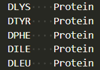

# Gromacs Tutorial

The necessary files will be downloadable [here]().

For D amino acids, include a residuetype.dat file to introduce a new residue into an existing force field. The force field file you will need will be [here](). You will need to have this folder in the same file where you make your system.

It should be the 3 or 4 letter amino acid code that was build during the avogadro step. It should look something like this. The link to the file is [here](). You will need to have this folder in the same file where you make your system.



First, open Avogadro and create your amino acid using this [tutorial](tutorial_avogadro.md).

Next open up the shell terminal in Rivanna. Type the command to be able to use Gromacs Commands.

```gromacs
module load gcc/11.4.0 openmpi/4.1.4 gromacs/2023.2
```
This command switches the pdb format to a gromacs format.

```gromacs
gmx_mpi pdb2gmx -f dkyfilinvert.pdb -o dkyfil.gro
```

Options will show up:
* Press 1 for charm force field from my own ff
* Press 1 to tip3p charmm 
* Press 0 to protonate lys NH3+
* Press 2 to amidate the leu ending CT2 

This commands makes the 4 x 4 x 4 grid.

```gromacs
gmx_mpi genconf -f dkyfil.gro -nbox 4 4 4 -rot yes -dist 1.6243 2.5864 1.8081 -o dKYFIL_64_box.gro
```

```gromacs
gmx_mpi solvate -cp KYFIL_64_peptides.gro -o KYFIL_64_peptides_solvate.gro -p topol.top
```

```gromacs
gmx_mpi grompp -f ions.mdp -c KYFIL_64_peptides_solvate.gro  -p topol.top -o ions.tpr
```

Gotta change mols to 64 in top file.

```gromacs
gmx_mpi genion -s ions.tpr -o dkyfil_64_peptides_solvate_ions.gro  -p topol.top -pname NA -nname CL -neutral -conc 0.15
```

Press 13 for SOL


